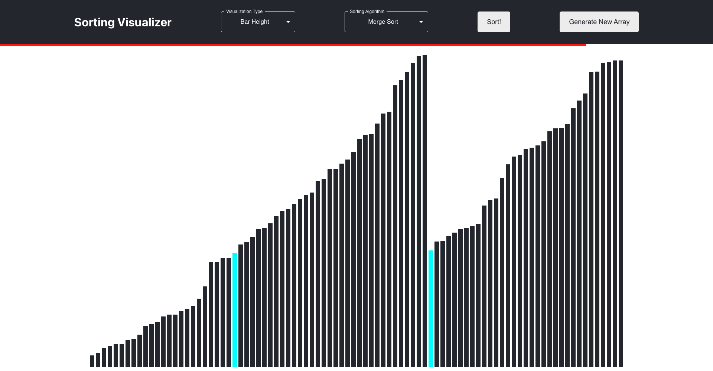
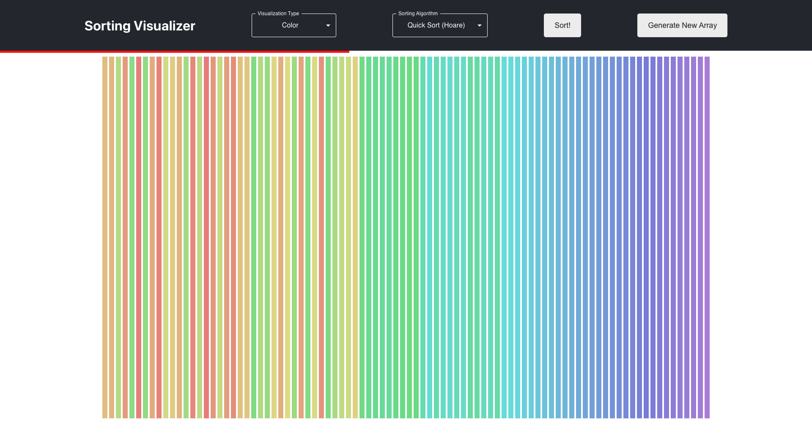

## Sorting Visualizer

An application used to help visualize and understand how sorting algorithms work. This was built with React, JavaScript, and CSS.

View this project [here](https://andresruiz01.github.io/sorting-visualizer/)!

## Project Status

This project is nearing completion. There are some additional sorting algorithms that could be visualized as well as some refactoring to complete.

## Project Screen Shots

## Installation and Setup Instructions

Clone down this repository. You will need `node` and `npm` installed globally on your machine.  

Installation:

`npm install`  

To Run Test Suite:  

`npm test` 

To Start Server:

`npm start`  

To Visit App:

`localhost:3000`  

## Reflection

I began this project to get a better understanding of how React works to prepare for our Senior Desing Project development. The goal was to build a simple sorting visualizer using various sorting algorithms.

The main obstacle I ran into was how to visualize the sorting algorithm process. I settled on generating a list of animations then iterating over those animations instead of animating the sorting process in real-time during the algorithm. This allows me to separate the sorting algorithm logic from the visualization logic. The brings up the issue with passing around animations throughout various recursive calls in the sorting algorithms. While I had a good understanding of how all of the sorting algorithms worked, this project required me to dive deeper and truly understand how all of the sorting algorithms worked.
